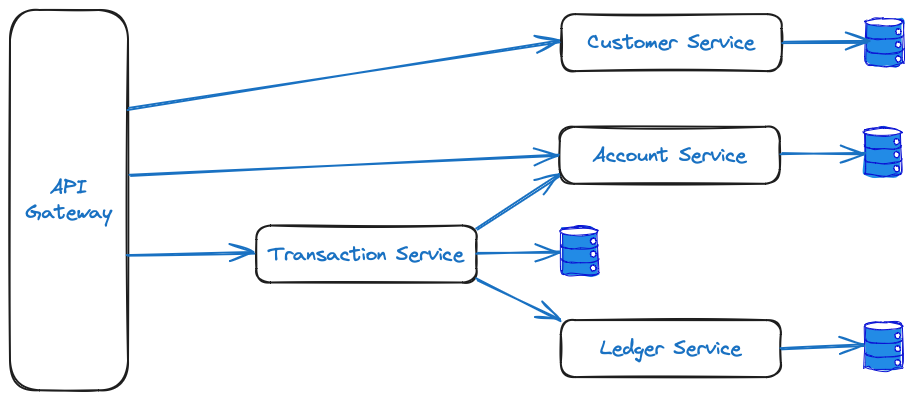

# Project Ledgify

## Context

`Ledgify` is a sample application developed to demonstrate skills and proficiencies in various tools and libraries.

This repository comprises arteficts for the key stages of a simple project: Outline, Design and Implementation.

## Project Outline

`Ledgify` is a simple platform banking service that facilitates inter-customer, multi-currency transactions and
exporting derivative analytics based on those transactions. The basic features include:
- Customer creation and management
- Customer currency-specific account creation, balance tracking and statement generation
- Submission and validation of cross-customer, intra-currency transactions

### Technical Description

`Ledgify` implements a distributed ledger system using Apache BookKeeper for managing transactions. The system will consist of multiple 
microservices for handling various aspects of the ledger, such as transaction processing, user management, and reporting. 
These services will be containerized using Docker, and effective testing will be implemented using Testcontainers. 
The system will expose a well-designed API using REST and use gRPC internally, and will include structured data persistence with appropriate 
validation.

## Project Design
### Architecture

#### Key Components
- **Customer Service**: Manages customer records and authentication details.
- **Account Service**: Manages customer accounts and balances.
- **Transaction Service**: Manages the lifecycle of transactions.
- **Ledger Service**: Manages ledgers for each customer account.
- **Reporting Service**: Generates reports based on customer account data.
- **API Gateway**: Provides a unified REST API interface.
- **Persistence Layer**: Uses a relational database (PostgreSQL) for structured data.

#### Additional features
- **gRPC**: internal services should be implemented with gRPC and protobuf.
- **Docker Setup**: Containerizes all components for easy deployment and local orchestration.
- **Testing**: Implement unit and integration tests using JUnit and Testcontainers.

### Tasks
- Define project goals and design
- Set up local development environment
- Set up infrastructural components
- Implement Customer Service
- Implement Account Service
- Implement Ledger Service
- Implement Transaction Service
- Implement API Gateway
- Implement Integration Tests